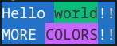

## Install

```bash
v install wygsh.chalk
```

## Example

```go
module main
import wygsh.chalk

fn main () {
	str1 := chalk.color8(
		'Hello ${chalk.color8('world', .green, .bg)}!!',
		.blue, .bg
	)
	str2 := color8(
		'MORE ${chalk.rgb('COLORS', [u8(200), 100, 255], .bg)!}!!',
		.red, .bg
	)

	println('${str1}\n${str2}')
}
```
output:


