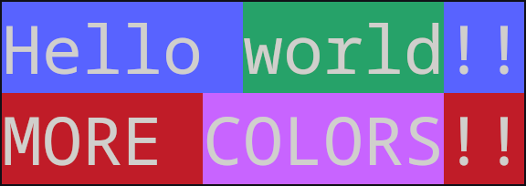

## Install

```bash
v install wygsh.chalk
```

## Example

```go
module main
import wygsh.chalk.graphics

fn main () {
	str1 := color8(
		'Hello ' + color8('world', .green, .bg) + '!!',
		.blue, .bg
	)
	str2 := color8(
		'MORE ' + rgb('COLORS', [u8(200), 100, 255], .bg)! + '!!',
		.blue, .bg
	)

	println(
		str1 + '\n' +
		str2
	)
}
```
output:
